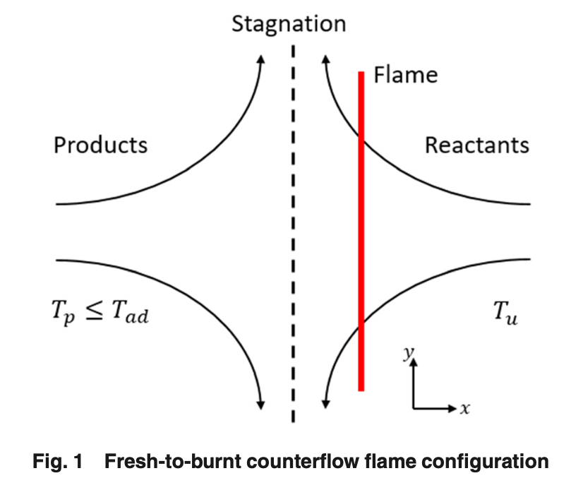
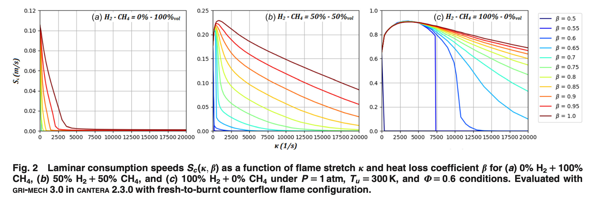
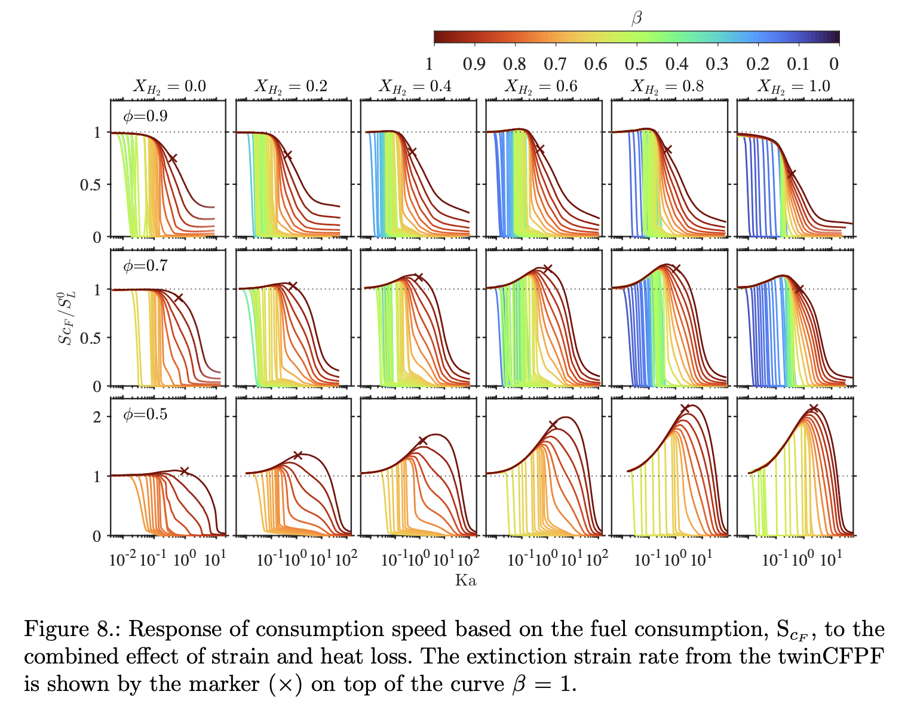

## 📍 Introduction

### [Cantera Documentation](https://cantera.org/documentation/index.html)

Cantera is an open-source suite of tools designed for solving problems related to chemical kinetics, thermodynamics, and transport processes.
It is widely used for simulating chemical reactions, including combustion, with precision and flexibility, making it a valuable tool for both research and industry.

### Project Introduction
In this project, **CanteraTabulation**, we explore the combustion process of a hydrogen-methane mixture.
By adjusting the hydrogen ratio in the mixture, we study how the flame's behavior changes.
Specifically, we use a counterflow premixed flame and vary the strain rate and heat loss to observe their effects on consumption speed and reaction dynamics.

## 💡 Preview

### counterflow flame configuration

### Graph patterns that change according to the CH4-H2 mixing ratio

### Final project outcome reflecting heat loss and strain rate

## 🎯 Getting Started
### Requirements
- Cantera 3.x
- Python

### Optional
- Anaconda-Navigator
- Jupyter Notebook

## 📝 License
This project uses **Cantera**, which is distributed under the **OSI-approved BSD 3-clause License**.
For full details, refer to the [LICENSE.txt](LICENSE.txt) file.

## 👩🏻‍💻 Author
Eunsori Cho, [@solheeing](https://github.com/solheeing)
