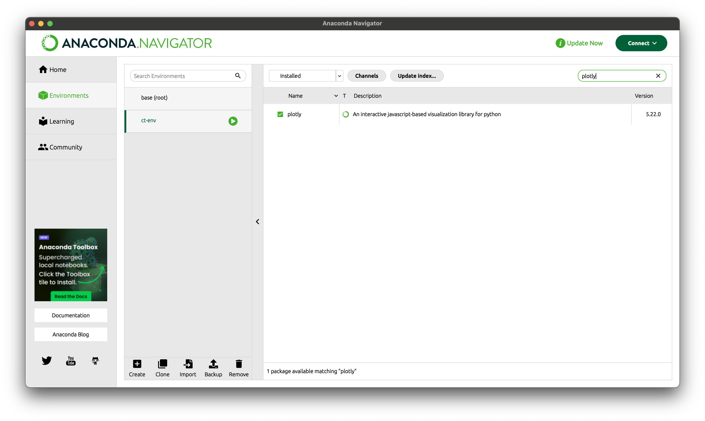

# 0. Introduction to Cantera

## ⚡️ Create a new environment to Cantera

### Terminal

```
conda create --name ct-env --channel cantera cantera ipython matplotlib jupyter
conda active ct-env
```

### Anaconda Navigator

1. Home-set ct-env channels
2. Environments-check libraries we will use(**keras**, **pandas**, **matplotlib** etc.)
3. install **plotly**



## ⚡️ Basic equations using in Cantera

### Investigate different effects by changing

- the operating conditions(T, P, equivalence ratio)

### Governing equations

- **Equilibrium States(0D)**
    - Gibbs free energy:
    
    $$
    G=H-TS
    $$
    
    - A reaction spontaneously occurs if △G<0
    - A reaction does NOT spontaneously occur if △G>0
    - Equilibrium is reached when △G=0
    
    ### Equilibrium states during combustion
    
    - We can use constant T and P for the calculation of the Lower Heating Value(LHV)
        - Fuel+O2 → transformed in CO2+H2O
    - We can use constant H and P for the adiabatic flame temperature T
    - provides the final gas composition and the adiabatic flame temperature

- **Homogeneous Reactor(0D with time evolution)**
    - We need a homogeneous reactor simulation
    - The ignition delay time of a mixture can be estimated with constant volume reactor calculation

- **Laminar premixed flame(1D steady)**
    - For a given inlet velocity, called laminar flame speed(SL), the system is in a steady state
    - And Cantera uses a damped modified Newton solver with internal time integration
    - The Newton method to solve the system of equations for each time step:
    
    $$
    H(U)=L(U)-dU/dt=0
    
    $$
    
    - The new U is used as a new starting estimate for the steady-state problem