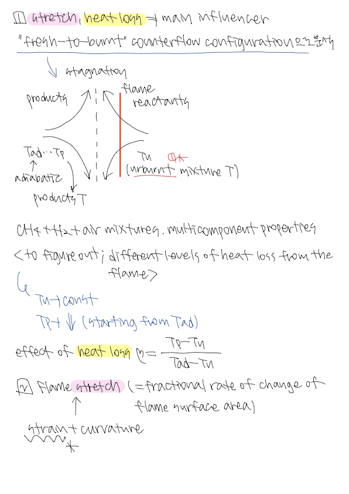
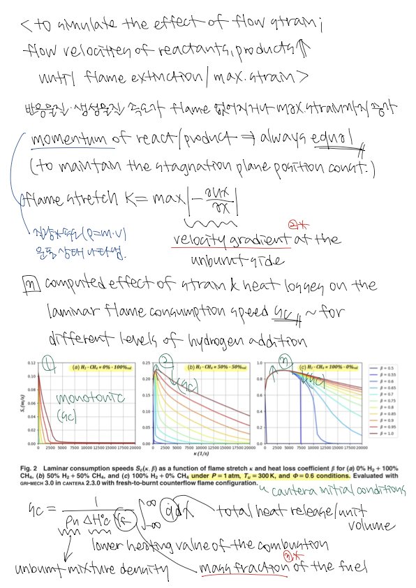
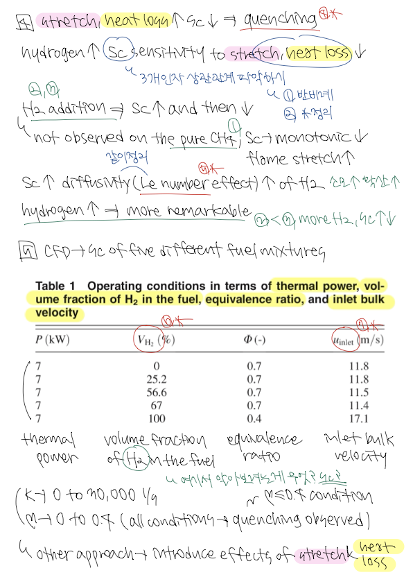
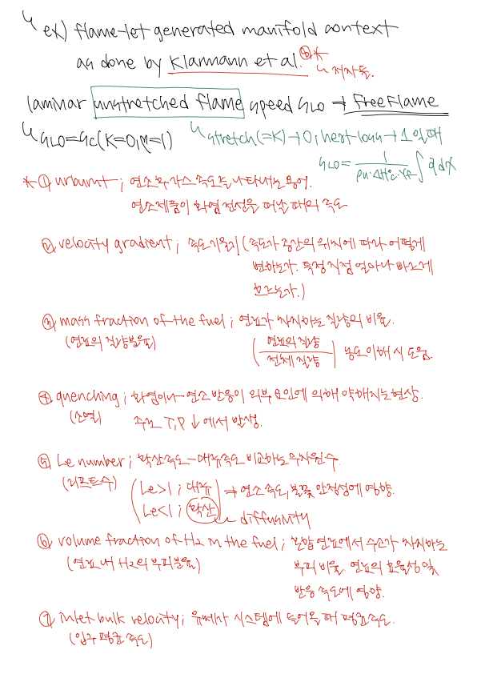
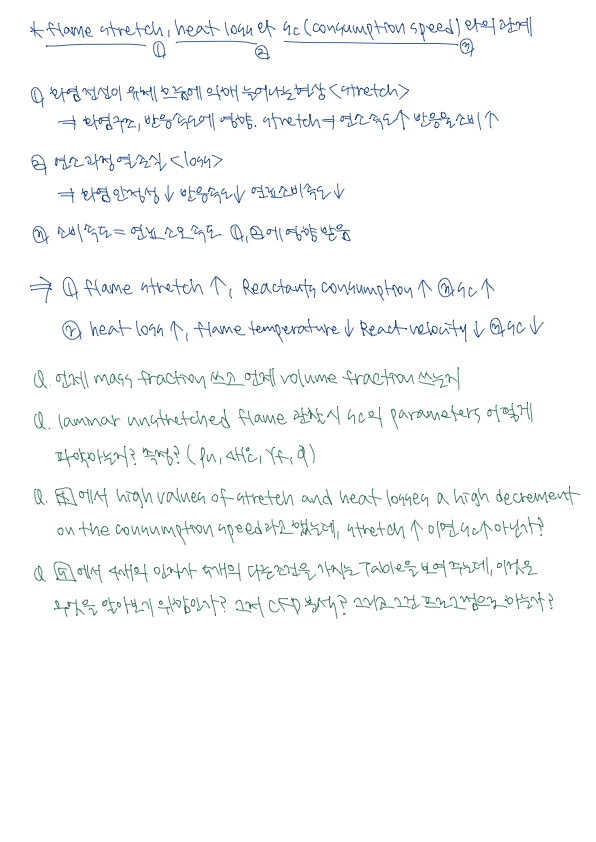

# 2. Kutkan2022a

# ⚡️Laminar Flame Analysis

---

### Questions

> When do we use mass fraction and when do we use volume fraction?
> 

⇒ contents of the fraction, just about the context…

⇒ sometimes translation is needed, almost the same, volume fraction uses more

> When observing the laminar unstretched flame, how do I figure out the parameters of Sc? Do I have to measure it?
> 
> 
> (unburnt mixture density, mass fraction of the fuel, lower heating value of the combustion, total heat release per unit volume)
> 

⇒ dependent on the T, P, composition of the fuel

⇒ tabulate the consumption speed

⇒ sets initial conditions with set T, P, composition

⇒ choose tables

> In the fourth paragraph, high values of stretch and heat losses decrease the consumption speed. Doesn't the consumption speed increase when the stretch increases?
> 

⇒ decrease the flame speed, mentioned as quenching extinguishes the flame

> In the last paragraph, four factors show a table with five different conditions, what is this to find out?
> 

⇒ to simulate CFD. Parameters for CFD.

⇒ velocity, equivalent ratio is more important.

---

### New Questions

> So table is not given and we have to make it?
> 

⇒ set 1kg of fuel

⇒ density depends on T, P, the composition of the gas → Cantera automatically gives the density

⇒ velocity field is also given

⇒ lower heating value → hydrogen, search on google

⇒ generate the table

> In this paper, we observed how it changes depending on how much hydrogen is added. Can we select it as a topic to observe the change in the graph according to the change in the concentration of methane and proceed with the project?
> 

⇒ have just only 1 plot. pure methane and pure hydrogen

⇒ we could change T, P, and other parameters and observe

> how do i change the value of the stretch?
> 

⇒ same process as consumption speed in python. All is the task

---

### Important Notions

- FreeFlame and Counterflow Diffusion Flame
- consumption speed → simulate, compute
- stretch of the flame, heat losses(ratio of the different temperatures, adiabatic temperature check), consumption speed python

---

### TODOs

1. Create the journey
2. set what is the steps(challenge you need to solve with python)
3. equation, import in Python using Cantera
4. Need to get the unburnt mixture → how do I get the mix? ⇒ refer to counterflowPremixedFlame file. Temperature used in CFD is fixed
5. Identify what I need to do to get the temperature of the project
6. Get the tables → gant diagram and we want to compute this table in Cantera **premixed counterflame

---

### Notes

- The initial condition of the flame is fixed
- use one setup value
- same ratio, temp, and pressure. change another thing(ex: gas)

---

### Important things

1. how to change temperature and pressure
2. how to change stretch and heat loss
3. how to change consumption speed → and create a loop in python
4. the thing is all the compositions depend on the flame