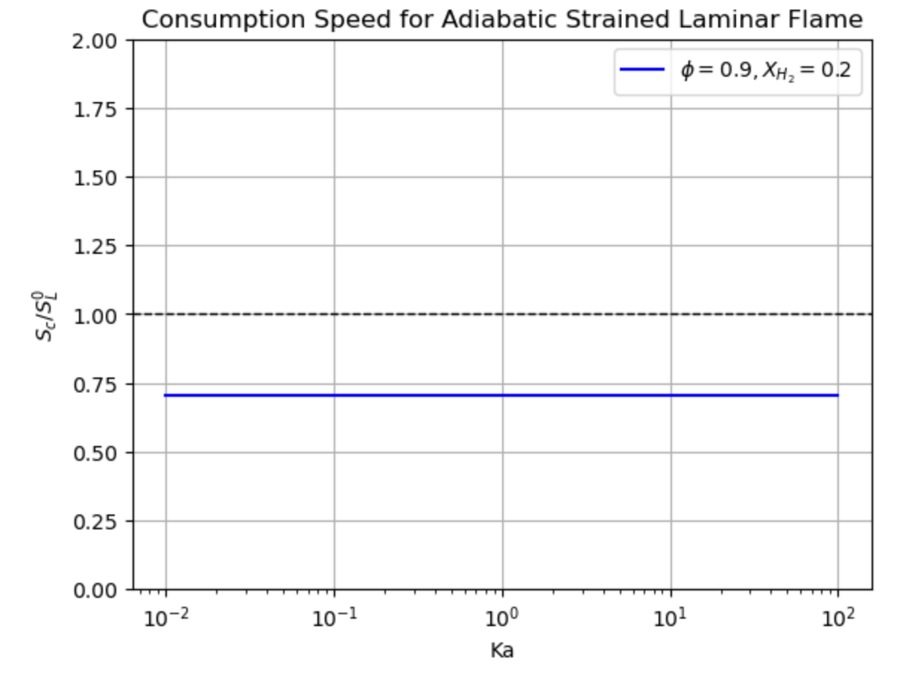

# 6. Strain rate, Heat loss, Consumption speed

# ⚡️Codes & Questions

### Change the heat loss, stretch function, and consumption speed (from paper)

```python
def get_adiabatic_temperature(gas):
    """
    calculate adiabatic temperature
    
    :param gas: Cantera `Solution` object
    :return: adiabatic temperature (K)
    """
    gas.equilibrate('HP')  # conditions: enthalpy, pressure constant
    Tad = gas.T
    return Tad

# calculate adiabatic temperature by using gas1
Tad = get_adiabatic_temperature(gas1)
print(f'adiabatic temperature (Tad): {Tad:.2f} K')
```

```python
def calculate_heat_loss_coefficient(Tp, Tad, Tr):
    """
    :param Tp: temperature of the product stream(from fl2) (K)
    :param Tad: temperature of the products under adiabatic conditions (K)
    :param Tr: temperature of the reactants(from fl1) (K)
    :return: heat loss coefficient (beta)
    """
    # calculate heat loss
    beta = (Tp - Tr) / (Tad - Tr)
    return beta

# set parameter value
Tp = fl2.products.T
Tad = Tad
Tr = T0

# calculate heat loss coefficient
beta = calculate_heat_loss_coefficient(Tp, Tad, Tr)
print(f'heat loss coefficient (beta): {beta:.3f}')
```

> I tried to make an equation for heat loss coeffieicnt beta, and it needs adiabatic temperature Tad. So in front of the function, I add a new function that calculate adiabatic temperature by using gas1. Is this process necessary and is it right?
> 

⇒ get adiabatic temperature from the laminar flame object.

```python
def calculate_strain_rate(width, speed, mdot):
    """
    Calculate the strain rate coefficient Ka

    :param width: Diffusive laminar flame thickness (m)
    :param speed: Unstretched laminar flame speed (m/s)
    :return: Strain rate coefficient Ka
    """
    if speed == 0:
        raise ValueError("Laminar flame speed cannot be zero.")
    
    Ka = (width / speed) * mdot
    return Ka

# set parameter value
width = width
speed = 0.4  # example value

Ka = calculate_strain_rate(width, speed, mdot_reactants)
print(f"The strain rate coefficient Ka: {Ka:.4f}")
```

> How to set up unstretched laminar flame speed?
> 

⇒ use the previous example. choose the first value of the laminar freeflame.

```python
def calculate_consumption_speed(flame, gas, fuel_species):
    """
    Calculate the consumption speed S_cF using the given flame and gas object

    :param flame: Cantera flame object
    :param gas: Cantera gas object
    :param fuel_species: List of fuel species names (e.g., ['CH4', 'H2'])
    :return: Consumption speed S_cF
    """
    rho_u = gas.density  # density
    
    # calculate (Y_k,b - Y_k,u)
    mass_fraction_diff = 0
    integral_numerator = 0
    
    for fuel in fuel_species:
        i_fuel = gas.species_index(fuel)  # get species index
        Y_k_b = flame.Y[i_fuel, -1]  # mass fraction of reactants
        Y_k_u = flame.Y[i_fuel, 0]   # mass fraction of products
        mass_fraction_diff += Y_k_b - Y_k_u

        # integrate by using net production rate and molecular weights
        omega_k = flame.net_production_rates[i_fuel]  # fuel net production rate
        molecular_weight = gas.molecular_weights[i_fuel]  # fule molecular weights
        integral_value = scipy.integrate.simpson(molecular_weight * omega_k, x=flame.grid)
        integral_numerator += integral_value

    # calculate S_cF
    S_cF = integral_numerator / (rho_u * mass_fraction_diff)
    return S_cF

fuel_species = ['CH4', 'H2']
S_cF = calculate_consumption_speed(fl2, gas1, fuel_species)
print(f'Consumption speed S_cF: {S_cF:.5f} m/s')
```

```python
# example code: Evaluation of Reaction Rate with cantera, numerator part
ih2=gas.species_index('H2') # get species index
# molecular weights * net production rates and calculate consumption speed
scipy.integrate.simpson(gas.molecular_weights[ih2] * flame.net_production_rates[ih2], x=flame.grid)
```

$$
S_{cF} = \frac{\sum_{k=1}^{N_f} \eta_k \int_{-\infty}^{\infty} \dot{\omega}_k \, dx}{\rho_u \sum_{k=1}^{N_f} \eta_k (Y_{k,b} - Y_{k,u})}
$$

> This is the code about consumption speed.
Second one is the example code, and the question is, can I use the second code only to setup the consumption speed? (The code is only about H2)
> 

⇒ yes but add the code about CH4, and add the code about the denominator.

### Compare with a certain value

```python
import cantera as ct
import numpy as np
import matplotlib.pyplot as plt
import scipy.integrate

p0 = 101325  # Pressure [Pa]
T0 = 300  # Initial temperature [K], Tr
phi = 0.9  # Equivalence ratio
alpha = 0.2  # Hydrogen mole fraction for X_H2 = 0.2
width = 0.002  # Width [m]
mdot_reactants = 10  # Mass flow rate example value [kg/m^2/s]

# Calculate hydrogen mole fraction based on alpha
xh2 = alpha / (1 - alpha)
fuel = {'CH4': 1, 'H2': xh2}
oxidizer = {'O2': 1, 'N2': 3.76}
```

```python
# Initialize gas objects
gas1 = ct.Solution('gri30.yaml')
gas1.TP = T0, p0
gas1.set_equivalence_ratio(phi, fuel, oxidizer)

gas2 = ct.Solution('gri30.yaml')
gas2.TP = T0, p0
gas2.set_equivalence_ratio(phi, fuel, oxidizer)

# Counterflow flame simulation for gas1
fl1 = ct.CounterflowPremixedFlame(gas=gas1, width=width)
fl1.transport_model = 'multicomponent'
fl1.energy_enabled = True
fl1.set_refine_criteria(ratio=3, slope=0.1, curve=0.2, prune=0.02)

fl1.reactants.mdot = mdot_reactants
fl1.products.mdot = mdot_reactants
fl1.set_initial_guess()
fl1.solve(loglevel=0, auto=True)
print(fl1.products.T)

# Counterflow flame simulation for gas2 with altered product conditions
fl2 = ct.CounterflowPremixedFlame(gas=gas2, width=width)
fl2.transport_model = 'multicomponent'
fl2.energy_enabled = True
fl2.set_refine_criteria(ratio=3, slope=0.1, curve=0.2, prune=0.02)

fl2.reactants.mdot = mdot_reactants
fl2.products.mdot = mdot_reactants

fl2.products.T = 2000 #product temperature
fl2.products.X =fl1.products.X #composition of the products

fl2.set_initial_guess(equilibrate=False)
fl2.solve(loglevel=0, auto=True)
print(fl2.products.T)
```

```python
# Functions for calculations
def get_adiabatic_temperature(gas):
    gas.equilibrate('HP')
    return gas.T

def calculate_heat_loss_coefficient(Tp, Tad, Tr):
    return (Tp - Tr) / (Tad - Tr)

def calculate_strain_rate(width, speed, mdot):
    return (width / speed) * mdot

def calculate_consumption_speed(flame, gas, fuel_species):
    rho_u = gas.density
    mass_fraction_diff = 0
    integral_numerator = 0
    for fuel in fuel_species:
        i_fuel = gas.species_index(fuel)
        Y_k_b = flame.Y[i_fuel, -1]
        Y_k_u = flame.Y[i_fuel, 0]
        mass_fraction_diff += Y_k_b - Y_k_u
        omega_k = flame.net_production_rates[i_fuel]
        molecular_weight = gas.molecular_weights[i_fuel]
        integral_value = scipy.integrate.simpson(molecular_weight * omega_k, x=flame.grid)
        integral_numerator += integral_value
    
    return integral_numerator / (rho_u * mass_fraction_diff)

# Adiabatic temperature and heat loss calculation
Tad = get_adiabatic_temperature(gas1)
Tp = fl2.products.T
Tr = T0  # Initial temperature as the reference
beta = calculate_heat_loss_coefficient(Tp, Tad, Tr)

# Range of Ka values and corresponding S_cF calculation
Ka_values = np.logspace(-2, 2, 100)  # Logarithmic range for Ka from 10^-2 to 10^2
S_cF_values = []

for Ka in Ka_values:
    # Assuming the speed varies for different Ka values
    speed = (width * mdot_reactants) / Ka  # Recalculate speed based on Ka and mass flow rate
    S_cF = calculate_consumption_speed(fl2, gas1, fuel_species)
    S_cF_values.append(S_cF)
```

```python
# Plot
plt.figure()
plt.plot(Ka_values, S_cF_values, label=r'$\phi=0.9, X_{H_2}=0.2$', color='blue')
plt.axhline(y=1, color='k', linestyle='--', linewidth=1)  # Stagnation line
plt.xscale('log')
plt.xlabel('Ka')
plt.ylabel(r'$S_c/S_L^0$')
plt.ylim(0, 2)
plt.title('Consumption Speed for Adiabatic Strained Laminar Flame')
plt.legend()
plt.grid(True)
plt.show()
```



> I kept changing the value of mdot_reactants and add Ka_values and S_cF_values to check different Ka and S_cF values, but it didn’t work. I couldn’t figure out what the problem is.
> 

⇒ You keep appending the same value(S_cF) even though it is an array that presents a linear line. Change the equation of the consumption speed.